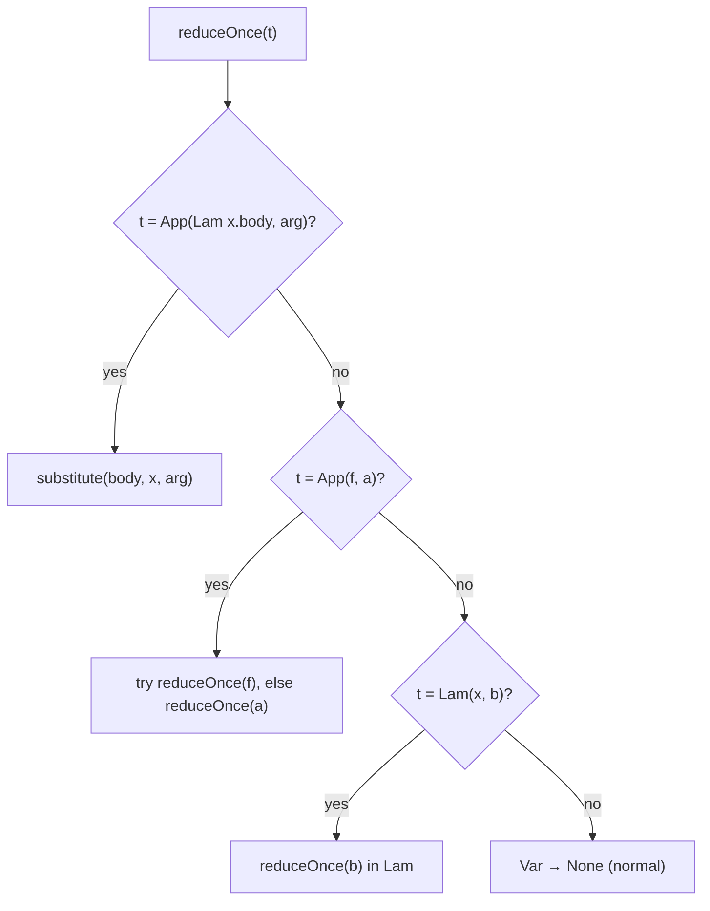

# Beta Reduction Engine

`src/lambda/betaReduction.scala` is the evaluation core. It parses the term string
produced by the encoder into a small AST, reduces it, and renders it back to text.

## Term AST

```scala
sealed trait Term
final case class Var(name: String)               extends Term
final case class Lam(param: String, body: Term)  extends Term
final case class App(fn: Term, arg: Term)        extends Term
```

## Public API

| Function | Purpose |
| --- | --- |
| `betaReductionStep(term)` | Perform exactly one leftmost-outermost β-step |
| `betaReductionSolve(term)` | Reduce to β-normal form (capped at 10000 steps) |
| `betaReductionSteps(term)` | Return every term from input to normal form, inclusive |
| `parseTerm(term)` | Expose the parser to the visualiser |

If a term is already in normal form, `betaReductionStep` returns it unchanged.

## Parser

`tokenize` splits on whitespace, `.`, parentheses, `λ` and `\`. `parseExpr` binds
λ as loosely as possible, `parseApp` makes application left-associative, and
parentheses group. This mirrors the notation in
[Lambda Calculus Basics](/concepts/lambda-calculus).

## Reduction strategy

`reduceOnce` finds the leftmost-outermost redex:

```scala
case App(Lam(x, body), arg) => Some(substitute(body, x, arg))
case App(f, a) =>
  reduceOnce(f) match {
    case Some(f2) => Some(App(f2, a))
    case None     => reduceOnce(a).map(App(f, _))
  }
case Lam(x, b) => reduceOnce(b).map(Lam(x, _))
case Var(_)    => None
```



`betaReductionSolve` and `betaReductionSteps` run `reduceOnce` in a tail-recursive
loop with a $10000$-step cap, so non-terminating terms (like $\Omega$) return
after the cap instead of looping forever.

## Capture-avoiding substitution

`substitute(t, x, s)` computes $t[x := s]$:

```scala
case Var(y)    => if (y == x) s else Var(y)
case App(f, a) => App(substitute(f, x, s), substitute(a, x, s))
case Lam(y, b) =>
  if (y == x) Lam(y, b)                 // shadowed, stop
  else if (freeVars(s).contains(y)) {   // would capture -> rename
    val z = fresh(y, freeVars(b) ++ freeVars(s) + x)
    Lam(z, substitute(substitute(b, y, Var(z)), x, s))
  } else Lam(y, substitute(b, x, s))
```

The `fresh` helper appends an incrementing integer until it finds a name not in
the taken set ($y_1$, $y_2$, …), guaranteeing a capture-free result.

## Rendering

`render` prints minimally-parenthesised terms: function positions that are `Lam`
get parentheses, argument positions that are anything but a `Var` get parentheses.
This keeps the step-by-step output readable.

::: callout tip "Try it"
Combine `:steps` with `:visu` to watch `reduceOnce` walk a term one redex at a
time. See [Visualisation & Reduction Steps](/guides/visualisation).
:::
