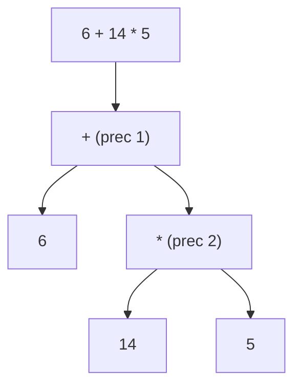

# Calculation & Parsing

`src/calculation.scala` turns a human-written expression into a Church-encoded
lambda term, and can decode a Church numeral back into a decimal.

::: steps

1.  **Clean**
    Strip all whitespace from the input.

2.  **Tokenize**
    Split into numbers, operators, parentheses and `$`-prefixed atoms.

3.  **Parse**
    Use precedence climbing into an `Expr` AST.

4.  **Encode**
    Map the AST onto the `lambda` combinators.

:::

## The AST

```scala
sealed trait Expr
final case class Num(n: Int)                       extends Expr
final case class Atom(sym: String)                 extends Expr
final case class BinOp(op: Char, l: Expr, r: Expr) extends Expr
```

## Tokenizer

`tokenize` walks the cleaned string and produces a `List[String]`:

- a `$` prefix produces an atom (see [The `$` Escape Syntax](/guides/dollar-syntax));
- a run of digits becomes a number token;
- `+ - * / ^ ( )` become single-character tokens;
- anything else throws `IllegalArgumentException`.

## Parser: precedence climbing

The parser encodes two facts about arithmetic:

| Operator | Precedence | Associativity |
| --- | --- | --- |
| `+`, `-` | 1 | left |
| `*`, `/` | 2 | left |
| `^` | 3 | **right** |

This is captured directly:

```scala
private val Prec        = Map('+' -> 1, '-' -> 1, '*' -> 2, '/' -> 2, '^' -> 3)
private val RightAssoc  = Set('^')
```

`parseExpr` climbs the operator list, recursing with a higher minimum precedence
on the right for left-associative operators and the same precedence for
right-associative `^`. So `6+14*5` parses as $6+(14\times5)$:



## Encoder

`toLambda` maps the AST onto the `lambda` combinators:

| AST node | Encoding |
| --- | --- |
| `Num(n)` | `lambda.naturalNumberToLambda(n)` |
| `Atom("true")` / `Atom("false")` | Church booleans |
| `Atom(sym)` | the symbol verbatim |
| `BinOp('+', l, r)` | `lambda.additionToLambda` |
| `BinOp('*', l, r)` | `lambda.multiplicationToLambda` |
| `BinOp('^', l, r)` | `lambda.powerToLambda` |
| other `BinOp` (`-`, `/`) | `UnsupportedOperationException` |

::: callout warning "Only +, * and ^ are encoded"
Subtraction and division are parsed (for precedence) but not yet encoded:
`BinOp('-', ...)` and `BinOp('/', ...)` throw. `main.solve` catches the exception
and prints `invalid equation`.
:::

## Decoding numerals

`lambdaToNaturalNumber` scans the term for the prefix $\lambda f.\lambda x.$ and
then counts $f(\ldots)$ applications in the body, mapping the count to a decimal
string. It skips whitespace and leaves anything it cannot recognise untouched, so
non-numeral results (such as `$`-atoms) are printed as-is.
