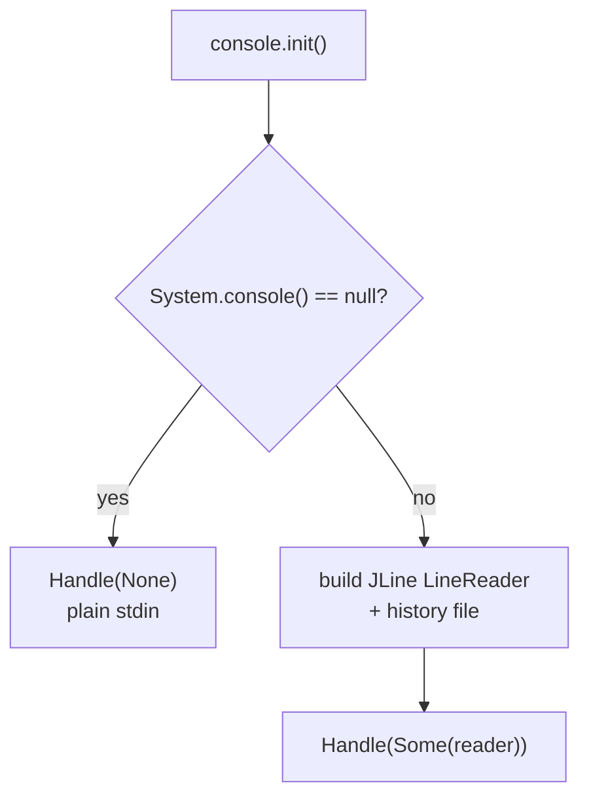

# Console & Settings

These two small modules keep terminal input and configuration separate from the
calculator's logic.

## `settings.scala`

`Settings` is an immutable case class holding the runtime configuration:

```scala
final case class Settings(
  visuMode: Boolean,   // draw lambda diagrams instead of solving
  showSteps: Boolean,  // walk through every single beta reduction step
  autoSteps: Boolean,  // in step mode: wait stepDelay ms (true) or for enter (false)
  stepDelay: Int       // ms between steps in auto mode
)
```

Defaults come from `settings.default`:

| Setting | Default |
| --- | --- |
| `visuMode` | `false` |
| `showSteps` | `false` |
| `autoSteps` | `true` |
| `stepDelay` | `700` |

`settings.all(s)` formats the current configuration, which is what `:settings`
prints. Because the record is immutable, toggling a setting in `main.command`
returns a `copy`; nothing is mutated in place.

::: callout info "Why immutable?"
Immutable settings mean the whole REPL loop is a pure function of `(n, settings,
handle)`. Each command returns a new `Settings` value that the next iteration
receives - there is no global mutable state to reason about.
:::

## `console.scala`

`console` wraps terminal input with a thin, immutable `Handle`:

```scala
final case class Handle(reader: Option[LineReader])
```



- On a real TTY, `init()` builds a JLine `LineReader` so arrow keys, editing and
  command history work. The history file is `~/.lambdaCalc_history`, created with
  `rw-------` permissions (`touchHistory`).
- When input is piped (no system console), `init()` returns `Handle(None)` and
  `readLine` falls back to `scala.io.StdIn.readLine` without line editing.

`readLine` returns `null` on end-of-file or Ctrl-C, which the main loop treats as
"quit".

## How `main` threads them

`src/main.scala` keeps both values in its recursion instead of storing them
globally:

```scala
def loop(n: Int, s: Settings, h: console.Handle): Unit = ...
```

- `parseArgs` folds command-line flags into `Settings` at startup.
- `command` handles `:` lines and returns a possibly-updated `Settings`.
- `solve` performs the encode → reduce → decode pipeline and dispatches to either
  the step viewer or the plain/diagram output.

This is why every interactive command both prints its effect and returns the new
configuration for the next iteration of the loop.
