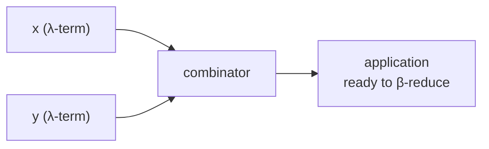

# Lambda Encoding

`src/lambda/lambda.scala` is the smallest module: it holds the Church encodings
and arithmetic combinators as string builders.

## Numerals

```scala
def naturalNumberToLambda(n: Int): String
```

Builds $\lambda f.\lambda x.$ followed by $n$ nested applications of $f$:

$$
\begin{aligned}
0 &\rightarrow \lambda f.\lambda x.\,x \\
1 &\rightarrow \lambda f.\lambda x.\,f(x) \\
2 &\rightarrow \lambda f.\lambda x.\,f(f(x)) \\
n &\rightarrow \lambda f.\lambda x.\,f(f(\ldots f(x)\ldots))
\end{aligned}
$$

Negative inputs return the empty string.

## Booleans

```scala
def boolToLambda(n: Boolean): String
```

| Input | Result |
| --- | --- |
| `true` | $\lambda x.\lambda y.\,x$ |
| `false` | $\lambda x.\lambda y.\,y$ |

## Arithmetic combinators

Each combinator takes the two already-encoded operands and wraps them:

$$
\begin{aligned}
\text{additionToLambda}(x, y) &=\; (\lambda m.\lambda n.\lambda f.\lambda x.\; m\,f\,(n\,f\,x))\,(x)\,(y) \\
\text{multiplicationToLambda}(x, y) &=\; (\lambda m.\lambda n.\lambda f.\; m\,(n\,f))\,(x)\,(y) \\
\text{powerToLambda}(x, y) &=\; (\lambda m.\lambda n.\; n\,m)\,(x)\,(y)
\end{aligned}
$$

These are the standard Church-encoded definitions described in
[Church Encoding](/concepts/church-encoding), emitted with the operands already
substituted into the application so the term is ready to β-reduce.



::: callout info "Decoding lives elsewhere"
There is a stub `lambdaToNaturalNumber` in this file, but the actual decoder used
by the calculator is `calculation.lambdaToNaturalNumber`.
:::
