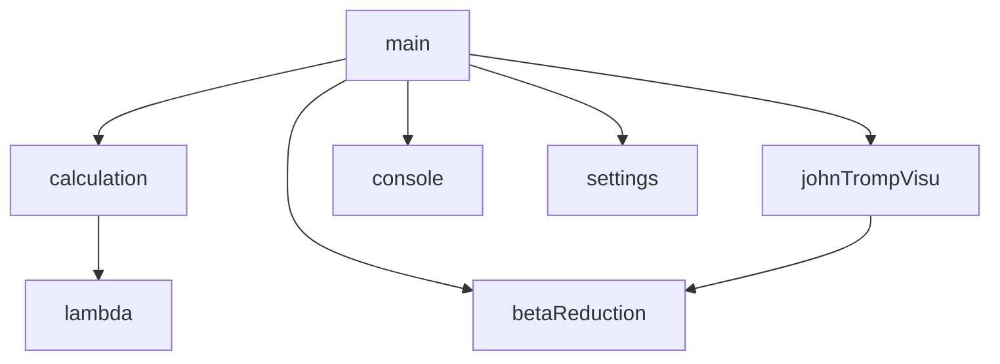
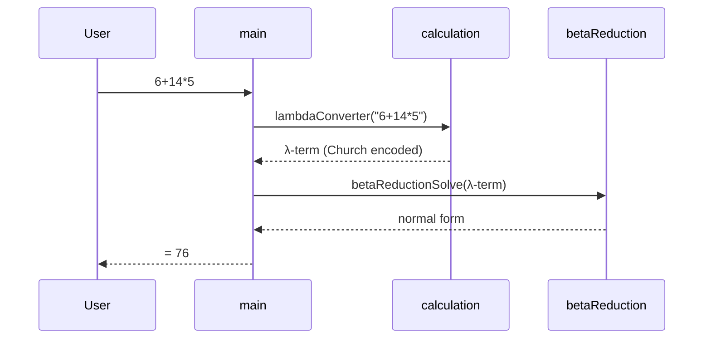

# Architecture Overview

LambdaCalc is a small Scala 3 project built with scala-cli. The source lives in
`src/` and is organised into three layers.

```text
src/
├── main.scala                 - REPL loop, argument parsing, command handling
├── settings.scala             - immutable Settings case class + defaults
├── console.scala              - JLine-backed terminal input (history, editing)
├── calculation.scala          - expression → lambda term, numeral decoding
└── lambda/
    ├── lambda.scala           - Church encodings (numerals, booleans, arithmetic)
    ├── betaReduction.scala    - parser, β-reduction, substitution, rendering
    └── johnTrompVisu.scala    - ASCII John Tromp lambda diagrams
```

## Module dependencies



`main` is the only orchestrator; the `lambda` package never depends back on
`main`.

## Data flow of one equation

::: steps

1.  **Read**
    Read a line from the console (`console.readLine`).

2.  **Dispatch**
    If it starts with `:`, handle it as a command in `main.command`. Otherwise
    treat it as an equation.

3.  **Encode**
    Pass the equation to `calculation.lambdaConverter`, which strips whitespace,
    tokenizes, parses with precedence, and encodes to a lambda term.

4.  **Reduce**
    Pass the term to `betaReduction.betaReductionSolve` to obtain the normal form.

5.  **Decode**
    Decode the normal form back to a decimal with
    `calculation.lambdaToNaturalNumber`.

:::



## Modules at a glance

::: grids
    ::: grid
        ::: card "Calculation & Parsing" icon:calculator href:/architecture/calculation
        Tokenizer, precedence-climbing parser and the `$`-atom handling.
        :::
    :::
    ::: grid
        ::: card "Lambda Encoding" icon:function-square href:/architecture/lambda-encoding
        Church numerals, booleans and the arithmetic combinators.
        :::
    :::
    ::: grid
        ::: card "Beta Reduction Engine" icon:refresh-cw href:/architecture/beta-reduction
        Term AST, capture-avoiding substitution, leftmost-outermost reduction.
        :::
    :::
:::

::: grids
    ::: grid
        ::: card "John Tromp Visualiser" icon:pencil-ruler href:/architecture/visualiser
        de Bruijn conversion, grid layout and box-drawing rendering.
        :::
    :::
    ::: grid
        ::: card "Console & Settings" icon:terminal href:/architecture/console-settings
        JLine input handling and the immutable `Settings` record.
        :::
    :::
:::

## Design principles

::: callout info "Three ideas run through the codebase"
- **Immutability.** `Settings` and the JLine `Handle` are immutable records
  threaded through the loop; every toggle produces a new copy.
- **Layered separation.** Parsing/encoding, reduction and presentation do not
  know about each other's internals beyond narrow public entry points.
- **Graceful failure.** Invalid equations, oversized diagrams and non-terminating
  terms are handled with explicit guards or a $10000$-step cap.
:::
