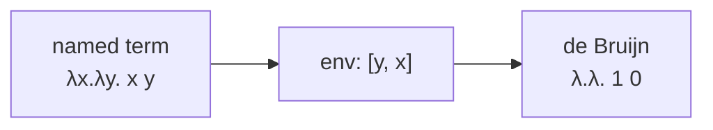

# John Tromp Visualiser

`src/lambda/johnTrompVisu.scala` draws terms as ASCII John Tromp lambda diagrams
(see [Lambda Diagrams](/concepts/lambda-diagrams) for the visual meaning).

## Public API

```scala
def visualize(term: String): String             // parse then draw
def render(term: betaReduction.Term): String    // draw an already-parsed term
```

`visualize` reuses `betaReduction.parseTerm`, so the visualiser accepts exactly
the same syntax the reducer does. If parsing or drawing fails it returns
`(could not draw term)`.

## Internal representation

The named term is first converted to a **de Bruijn** representation so binders and
variables can be matched positionally:

```scala
private sealed trait DTerm
private final case class DVar(index: Int)            extends DTerm
private final case class DLam(body: DTerm)           extends DTerm
private final case class DApp(fn: DTerm, arg: DTerm) extends DTerm
```

`toDeBruijn` walks the term with a list of bound names; a free variable becomes
index $-1$.



## Layout

`layout` builds a character grid (a `Vector[Vector[Char]]`) representing the
diagram geometry before any box-drawing is applied:

- A **variable** is a $3\times2$ cell containing a `.` stem.
- An **application** lays out both sides, pastes them into a joined grid, drops a
  vertical line from each side down to the bar, and draws the application bar.
- An **abstraction** lays out its body, adds a binder row on top, and then, using
  `connections` (which returns the abstraction depth and de Bruijn index of every
  variable), draws a connector down to each variable that reaches the binder.

Grid helpers (`blank`, `put`, `fillRow`, `fillColumn`, `overlay`) are all pure
functions returning a new grid, keeping the layout immutable.

## Rendering

`draw` converts the filled grid into Unicode box-drawing characters. For every
non-blank cell it inspects the four neighbours and selects a character:

| Neighbours | Character |
| --- | --- |
| up & down only | `│` |
| left & right only | `─` |
| corners / tees / cross | `┌ ┐ └ ┘ ├ ┤ ┬ ┴ ┼` |
| isolated | `·` |

Trailing whitespace is stripped from each line.

## Size guard

Before drawing, `render` checks the grid size:

```scala
private val MaxWidth  = 400
private val MaxHeight = 200
```

If the diagram exceeds either bound it returns
`(diagram too large to draw: WxH)` - protecting the terminal from a blown-up term.

::: callout tip "Why boxes?"
Every cell is classified by its four neighbours, so a single `.` stem grows into
the right connector no matter how the strokes cross - no special-casing of terms
is needed.
:::
