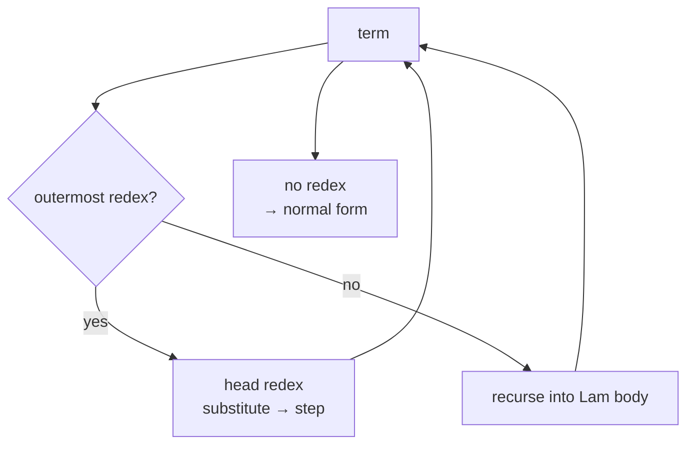

# Beta Reduction

**β-reduction** is the single computation rule of the lambda calculus. It is what
turns a lambda term into an answer.

## Redex and β-step

A **redex** (short for *reducible expression*) is an application whose left side
is an abstraction:

$$
(\lambda x.\,M)\;N
$$

A **β-step** replaces it by substituting the argument $N$ for every free
occurrence of $x$ in the body $M$:

$$
(\lambda x.\,M)\;N \;\to_\beta\; M[x := N]
$$

This single rule is repeated until no redex remains. A term with no redexes is in
**β-normal form**, i.e. fully evaluated.

## A concrete example

Consider the function that adds one to its argument:

$$
(\lambda x.\,x+1)\;5 \;\to\; 5+1 \;\to\; 6
$$

LambdaCalc performs exactly this kind of substitution, except that the numbers
and the `+` themselves are encoded as lambda terms, so the steps are longer - but
the rule is identical.

## Normal order in LambdaCalc

When a term contains several redexes, different strategies may reach the normal
form, or not terminate at all. LambdaCalc uses **leftmost-outermost**
(normal-order) reduction: it always reduces the **leftmost, outermost** redex
first. This strategy finds the normal form whenever one exists.

The reduction is implemented iteratively in `betaReduction.scala` with a hard
step cap of $10000$ to guarantee termination even for non-terminating terms such
as:

$$
\Omega = (\lambda x.\,x\,x)(\lambda x.\,x\,x)
$$

$\Omega$ has no normal form; without a cap the reducer would loop forever.

## Substitution is capture-avoiding

Naive substitution is wrong. Reducing

$$
(\lambda x.\lambda y.\,x)\;y
$$

by blindly replacing $x$ with $y$ would produce $\lambda y.\,y$, in which the
free $y$ has been *captured* by the inner binder. The correct result renames the
bound variable first:

$$
(\lambda x.\lambda y.\,x)\;y \;\to\; \lambda z.\,y
$$

::: callout warning "Capture is a real bug source"
The `substitute` function implements capture-avoiding substitution: whenever a
bound variable would capture a free variable of the substituted term, a fresh
name is generated first. Getting this wrong is one of the classic mistakes when
implementing a reducer by hand.
:::

## Seeing the steps

Run LambdaCalc with `--steps` (or type `:steps`) to print every intermediate term
from the input to the normal form. Use `:auto` and `:delay` - or `:manual` - to
control the pacing. See [Visualisation & Reduction Steps](/guides/visualisation).

::: callout info "Further reading"
See [Beta normal form](https://en.wikipedia.org/wiki/Beta_normal_form) and
[Sources](/sources).
:::
