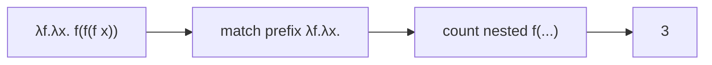

# Church Encoding

The lambda calculus has no built-in data types. **Church encoding** is the trick
of representing data - numbers, booleans, pairs, and more - purely as functions.

LambdaCalc relies on Church encoding for every number and boolean it uses.

## Church numerals

A natural number $n$ is encoded as a function that applies a given function $f$
exactly $n$ times to a given value $x$:

$$
\begin{aligned}
0 &= \lambda f.\lambda x.\,x \\
1 &= \lambda f.\lambda x.\,f\,x \\
2 &= \lambda f.\lambda x.\,f\,(f\,x) \\
n &= \lambda f.\lambda x.\,f^{\,n}\,x
\end{aligned}
$$

So the number *is* the operation "repeat something $n$ times". In LambdaCalc,
`naturalNumberToLambda(n)` builds exactly this nested `f(f(...f x...))` form.

## Church booleans

Booleans are functions that choose between two alternatives:

$$
\text{true} = \lambda t.\lambda f.\,t
\qquad
\text{false} = \lambda t.\lambda f.\,f
$$

`true` picks the first of two arguments, `false` picks the second. In LambdaCalc
these are produced by `boolToLambda` and reached through the `$true` / `$false`
atoms.

## Arithmetic from encoding

Because numerals are just repeated application, arithmetic can be defined by
combining them:

$$
\begin{aligned}
\text{add}\;&=\; \lambda m.\lambda n.\lambda f.\lambda x.\; m\,f\,(n\,f\,x) \\
\text{mul}\;&=\; \lambda m.\lambda n.\lambda f.\; m\,(n\,f) \\
\text{pow}\;&=\; \lambda m.\lambda n.\; n\,m
\end{aligned}
$$

Addition applies $f$ $m$ times then $n$ more times; multiplication composes the
two repetition functions; power applies the exponent's function to the base.

These are exactly the terms emitted by `lambda.additionToLambda`,
`lambda.multiplicationToLambda` and `lambda.powerToLambda`, and they are visible
in the first output line of the calculator:

```text
> 6+14*5
= (λm.λn.λf.λx. m f (n f x))(λf.λx.f(f(f(f(f(f x))))))(λf.λx.f(f(...x...)))
```

## From Church numerals back to decimals

To display an answer, LambdaCalc looks for the `λf.λx.` prefix and counts the
nested `f(...)` applications in the body - that count is the decimal number:



If the normal form is not a numeral (for example a raw `$`-atom), the decode
leaves the term as it is.

::: callout tip "Further reading"
More encodings - pairs, lists, recursion - can be built on the same idea. See
[Sources](/sources) for references.
:::
