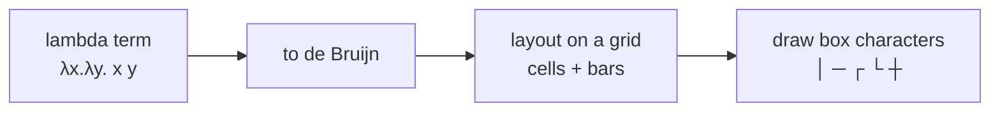

# Lambda Diagrams

There are many ways to visualise lambda terms, but only one is plausible to show
in a plain terminal: **John Tromp's lambda diagrams**.

LambdaCalc can draw terms this way instead of solving them - start with `--visu`
or toggle it at runtime with `:visu`.

## The three shapes

Tromp diagrams map the three lambda constructions to simple strokes:

| Construction | Drawing |
| --- | --- |
| **Abstraction** $\lambda x.\,M$ | a horizontal line (the binder) |
| **Variable** | a vertical line hanging down from its binder |
| **Application** $M\,N$ | a horizontal bar joining the leftmost variables |

Because everything is drawn with horizontal and vertical strokes, a term becomes
a kind of circuit diagram.

## From term to drawing



## Example

```text
> :visu
lambda diagrams: on
> 2
lambda term
──┬──┬──
  ·  │
  │  └─
  └────
normal form
──┬──┬──
  ·  │
  │  └─
  └────
```

In a real terminal the strokes join into box-drawing characters such as `─`, `│`,
`┌`, `└`; see the [implementation notes](/architecture/visualiser).

## How LambdaCalc draws them

::: steps

1.  **Layout**
    The term is converted to a de Bruijn representation, then every variable
    occurrence is given a small cell (3 wide, 2 tall) and cells are joined with a
    one-column gap. Applications add a downward drop and a joining bar;
    abstractions add a binder row and connect it to the variables that reach it.

2.  **Rendering**
    The filled grid is turned into box-drawing characters by inspecting each
    cell's four neighbours (`─`, `│`, `┌`, `┐`, `└`, `┘`, `├`, `┤`, `┬`, `┴`, `┼`).

3.  **Size guard**
    Grids larger than 400 columns or 200 rows are refused with a
    `(diagram too large to draw: WxH)` message so a runaway term cannot flood the
    terminal.

:::

::: callout info "Reference"
Original diagrams: [tromp.github.io/cl/diagrams.html](https://tromp.github.io/cl/diagrams.html)
(also linked in [Sources](/sources)). For an alternative visual language, see
[circuit notation](https://csvoss.com/circuit-notation-lambda-calculus).
:::
