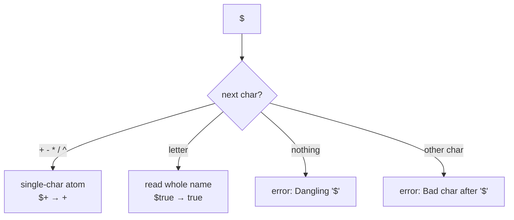

# The `$` Escape Syntax

By default, bare words and symbols in an expression are interpreted as
mathematical syntax (numbers and operators). The leading `$` tells LambdaCalc to
treat the following **token as a literal atom** instead - a raw lambda term or a
named boolean.

## What `$` does

`$<symbol>` marks the next token as an atom:

- `$true` and `$false` map to the Church booleans $\lambda x.\lambda y.\,x$ and
  $\lambda x.\lambda y.\,y$.
- `$+`, `$*`, `$^`, … are emitted **verbatim** as symbols, so they can be
  combined.

This mostly produces data that is unusable as a number, but it is perfectly
possible to β-reduce it - which is the interesting part.

## Examples

::: grids
    ::: grid
        ::: card "$false^$true" icon:variable
        `false` is "true times multiplied".
        :::
    :::
    ::: grid
        ::: card "$++$+" icon:plus
        `+` added to `+`.
        :::
    :::
    ::: grid
        ::: card "$*+$false" icon:asterisk
        Multiplication summed with `false`.
        :::
    :::
:::

Because atoms are emitted as-is, the result usually does **not** decode to a
decimal number. Use `:steps` or `:visu` to see what reduction does to them.

## How a `$`-token is read



## Worked example

```text
> $false^$true
= (λm.λn. n m)λx.λy.y(λx.λy.x)
...
```

The exact reduced output is left as an exercise - the point is to explore how the
raw lambda calculus behaves when you feed it operators and booleans directly.

::: callout warning "Not a number"
`$`-atoms are not decoded into decimal numbers by `lambdaToNaturalNumber`. Only
terms of the shape $\lambda f.\lambda x.\; f(\ldots f\,x\ldots)$ are recognised
as Church numerals.
:::
