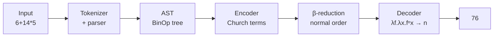

::: hero glow:true
    # LambdaCalc
    A command-line calculator that turns ordinary maths into **lambda calculus** - and solves it by β-reduction.

    ::: button "Get Started" /getting-started color:blue
    ::: button "The Concepts" /concepts/lambda-calculus color:gray
:::

## The idea

LambdaCalc does **not** calculate the way you would expect. Instead of evaluating
arithmetic directly, it translates a mathematical expression into the **lambda
calculus**, then solves it by **β-reduction**.

In symbols, every calculation follows the same shape:

$$
\underbrace{\text{expression}}_{\text{e.g. } 6+14\times 5}
\;\longrightarrow\;
\underbrace{\lambda\text{-term}}_{\text{Church encoded}}
\;\xrightarrow{\;\beta\text{-reduction}^*\;}
\underbrace{\text{normal form}}_{\text{a numeral}}
\;\longrightarrow\;
\underbrace{76}_{\text{decimal}}
$$

Every number, boolean and operator in the calculator is a **pure function**, and
the answer is found by repeatedly applying the one rule the lambda calculus has -
β-reduction.

::: grids
    ::: grid
        ::: card "Convert & solve" icon:calculator
        Type any expression using `+`, `-`, `*`, `/`, `^` and parentheses; it is
        encoded into lambda terms and reduced back to a number.
        :::
    :::
    ::: grid
        ::: card "Inspect the steps" icon:list-ordered
        Use `:steps` to walk through every single β-reduction from the original
        term down to the normal form.
        :::
    :::
    ::: grid
        ::: card "Draw lambda diagrams" icon:pencil-ruler
        Use `:visu` to render terms as ASCII **John Tromp lambda diagrams**
        instead of solving them.
        :::
    :::
:::

## See it work

Type an expression and LambdaCalc reports three lines: the encoded lambda term,
its β-normal form, and the decoded decimal.

```text
$ scala-cli run .
Calculator started, enter an equation to solve (empty line to quit):
type :settings for the settings, :visu to toggle the lambda diagrams
> 6+14*5
= (λm.λn.λf.λx. m f (n f x))(λf.λx.f(f(f(f(f(f x))))))(λf.λx.f(f(...f x...)))
= λf.λx.f(f(f(f(f(f(f(f(f(f(f(f(f(f(f(f(f(f(f(f(f(f(f(f(f(f(f(f(f(f(f(f(f(f(f(f(f(f(f(f(f(f(f(f(f(f(f(f(f(f(f(f(f(f(f(f(f(f(f(f(f(f(f(f(f(f x))))))))))))))))))))))))))))))))))))))))))))))))))))))))))))))))))))))))
= 76
```

::: callout tip "Try this first" icon:terminal
Run `6+14*5` → `76`, then `2^8` → `256`, then toggle `:steps` to watch the
reduction unfold one redex at a time.
:::

## How a term flows



## Documentation map

::: grids
    ::: grid
        ::: card "Getting Started" icon:rocket href:/getting-started
        Install scala-cli, run the calculator and try your first expression.
        :::
    :::
    ::: grid
        ::: card "Concepts" icon:book-open href:/concepts/lambda-calculus
        The lambda calculus, β-reduction, Church encoding and lambda diagrams.
        :::
    :::
:::

::: grids
    ::: grid
        ::: card "Guides" icon:wrench href:/guides/commands
        Command-line flags, interactive `:` commands, visualisation and `$` syntax.
        :::
    :::
    ::: grid
        ::: card "Architecture" icon:layers href:/architecture/overview
        How the Scala source is organised, from tokenizer to visualiser.
        :::
    :::
:::

::: callout info "Start here"
New to the project? Head to [Getting Started](/getting-started) to install and
run LambdaCalc, then read [Concepts](/concepts/lambda-calculus) for the theory
behind it. Background references are collected on the [Sources](/sources) page.
:::
