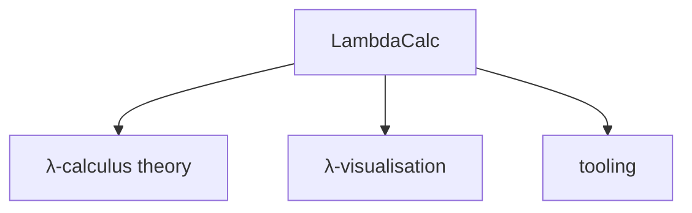

# Sources

Background reading on the lambda calculus and lambda-diagram visualisation, plus
the tooling this project is built with.

## Lambda calculus & visualisation

::: grids
    ::: grid
        ::: card "Lambda calculus" icon:book-open
        - [Lambda calculus - Wikipedia](https://en.wikipedia.org/wiki/Lambda)
        - [CS704 notes (Horwitz, UW–Madison)](https://pages.cs.wisc.edu/~horwitz/CS704-NOTES/1.LAMBDA-CALCULUS.html)
        - [Selinger - Lambda Calculus Notes (PDF)](https://www.irif.fr/~mellies/mpri/mpri-ens/biblio/Selinger-Lambda-Calculus-Notes.pdf)
        - [Beta normal form - Wikipedia](https://en.wikipedia.org/wiki/Beta_normal_form)
        :::
    :::
    ::: grid
        ::: card "Visualisation" icon:pencil-ruler
        - [John Tromp's lambda diagrams](https://tromp.github.io/cl/diagrams.html)
        - [Circuit notation for the λ-calculus - Chelsea Voss](https://csvoss.com/circuit-notation-lambda-calculus)
        - [visual-lambda - GitHub](https://github.com/bntre/visual-lambda)
        - [Lambda Calculus applet - Cruz Godar](https://cruzgodar.com/applets/lambda-calculus/)
        - [Paul Brauner - YouTube](https://www.youtube.com/@PaulBrauner)
        :::
    :::
:::

## Tooling

::: grids
    ::: grid
        ::: card "scala-cli" icon:terminal
        The build and run tool. [scala-cli.virtuslab.org](https://scala-cli.virtuslab.org/)
        :::
    :::
    ::: grid
        ::: card "JLine" icon:command
        Interactive terminal input. [github.com/jline/jline3](https://github.com/jline/jline3)
        :::
    :::
    ::: grid
        ::: card "docmd" icon:file-text
        Documentation generator used for this site. [docmd.io](https://docmd.io)
        :::
    :::
:::
